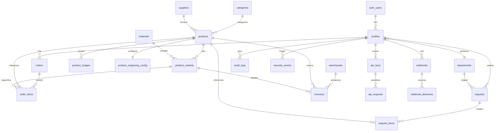

# 🗄️ ESQUEMA DE BANCO DETALHADO
**Documentação Completa da Estrutura de Dados**

---

## 📋 ÍNDICE
1. [Visão Geral](#visão-geral)
2. [Diagramas ERD](#diagramas-erd)
3. [Tabelas Detalhadas](#tabelas-detalhadas)
4. [Relacionamentos](#relacionamentos)
5. [Índices e Performance](#índices-e-performance)
6. [Triggers e Functions](#triggers-e-functions)
7. [Row Level Security](#row-level-security)
8. [Backup e Manutenção](#backup-e-manutenção)

---

## 🎯 VISÃO GERAL

### Estatísticas do Banco
- **Total de Tabelas**: 30
- **Total de Funções**: 11
- **Total de Triggers**: 25+
- **Total de Políticas RLS**: 50+
- **Total de Índices**: 40+

### Módulos Principais
1. **🔐 Autenticação** (2 tabelas)
2. **📦 Produtos** (8 tabelas)
3. **🛒 Pedidos** (2 tabelas)
4. **📋 Requisições** (2 tabelas)
5. **📊 Analytics** (2 tabelas)
6. **🔍 Auditoria** (2 tabelas)
7. **🔌 APIs** (4 tabelas)
8. **🎨 Gravação** (4 tabelas)
9. **📥 Importação** (1 tabela)
10. **🏭 Estoque** (3 tabelas)

---

## 🔗 DIAGRAMAS ERD

### Relacionamentos Principais


---

## 📊 TABELAS DETALHADAS

### 🔐 **MÓDULO DE AUTENTICAÇÃO**

#### `profiles` - Perfis de Usuário
```sql
CREATE TABLE public.profiles (
  id uuid DEFAULT gen_random_uuid() PRIMARY KEY,
  user_id uuid NOT NULL UNIQUE, -- FK para auth.users
  full_name text NOT NULL,
  role text NOT NULL DEFAULT 'vendedora',
  department_id uuid REFERENCES public.departments(id),
  position text,
  budget_limit numeric(10,2),
  active boolean NOT NULL DEFAULT true,
  created_at timestamptz NOT NULL DEFAULT now(),
  updated_at timestamptz NOT NULL DEFAULT now()
);
```

**Campos Especiais:**
- `user_id`: Referência para `auth.users` (gerenciado pelo Supabase)
- `role`: Enum virtual ('admin', 'manager', 'vendedora')
- `budget_limit`: Limite de orçamento para aprovações

**Índices:**
```sql
CREATE INDEX idx_profiles_user_id ON public.profiles(user_id);
CREATE INDEX idx_profiles_role ON public.profiles(role);
CREATE INDEX idx_profiles_department ON public.profiles(department_id);
```

#### `departments` - Departamentos
```sql
CREATE TABLE public.departments (
  id uuid DEFAULT gen_random_uuid() PRIMARY KEY,
  name text NOT NULL,
  description text,
  manager_user_id uuid, -- FK para profiles
  budget_limit numeric(12,2),
  active boolean NOT NULL DEFAULT true,
  created_at timestamptz NOT NULL DEFAULT now(),
  updated_at timestamptz NOT NULL DEFAULT now()
);
```

---

### 📦 **MÓDULO DE PRODUTOS**

#### `categories` - Categorias
```sql
CREATE TABLE public.categories (
  id uuid DEFAULT gen_random_uuid() PRIMARY KEY,
  name text NOT NULL,
  description text,
  parent_category_id uuid REFERENCES public.categories(id), -- Hierárquica
  active boolean NOT NULL DEFAULT true,
  created_at timestamptz NOT NULL DEFAULT now(),
  updated_at timestamptz NOT NULL DEFAULT now()
);
```

**Features:**
- **Hierarquia**: Categorias podem ter subcategorias
- **Self-referencing**: FK para própria tabela

#### `suppliers` - Fornecedores
```sql
CREATE TABLE public.suppliers (
  id uuid DEFAULT gen_random_uuid() PRIMARY KEY,
  name text NOT NULL,
  contact_person text,
  phone text,
  email text,
  address text,
  cnpj text UNIQUE,
  active boolean NOT NULL DEFAULT true,
  created_at timestamptz NOT NULL DEFAULT now(),
  updated_at timestamptz NOT NULL DEFAULT now()
);
```

#### `materials` - Materiais
```sql
CREATE TABLE public.materials (
  id uuid DEFAULT gen_random_uuid() PRIMARY KEY,
  name text NOT NULL,
  description text,
  price_multiplier numeric(4,2) DEFAULT 1.00, -- Multiplicador de preço
  active boolean NOT NULL DEFAULT true,
  created_at timestamptz NOT NULL DEFAULT now(),
  updated_at timestamptz NOT NULL DEFAULT now()
);
```

**Regra de Negócio:**
- `price_multiplier`: 1.0 = preço base, 2.5 = 150% mais caro

#### `products` - Produtos
```sql
CREATE TABLE public.products (
  id uuid DEFAULT gen_random_uuid() PRIMARY KEY,
  name text NOT NULL,
  description text,
  sku text UNIQUE,
  base_price numeric(10,2) NOT NULL,
  category_id uuid REFERENCES public.categories(id),
  supplier_id uuid REFERENCES public.suppliers(id),
  weight numeric(8,3), -- em gramas
  active boolean NOT NULL DEFAULT true,
  created_at timestamptz NOT NULL DEFAULT now(),
  updated_at timestamptz NOT NULL DEFAULT now()
);
```

**Índices Críticos:**
```sql
CREATE INDEX idx_products_sku ON public.products(sku);
CREATE INDEX idx_products_category ON public.products(category_id);
CREATE INDEX idx_products_active ON public.products(active);
CREATE INDEX idx_products_name_search ON public.products USING gin(to_tsvector('portuguese', name));
```

#### `product_variants` - Variações de Produtos
```sql
CREATE TABLE public.product_variants (
  id uuid DEFAULT gen_random_uuid() PRIMARY KEY,
  product_id uuid NOT NULL REFERENCES public.products(id),
  sku_variant text UNIQUE, -- Gerado automaticamente
  size text,
  color text,
  width text,
  material_id uuid REFERENCES public.materials(id),
  price_adjustment numeric(10,2) DEFAULT 0, -- Ajuste de preço
  active boolean NOT NULL DEFAULT true,
  created_at timestamptz NOT NULL DEFAULT now(),
  updated_at timestamptz NOT NULL DEFAULT now()
);
```

**Geração Automática de SKU:**
```sql
-- Trigger gera: PRODUTO-G-OURO para produto Gold em Ouro
-- Formato: {base_sku}-{size}-{color}-{material_prefix}
```

#### `product_images` - Imagens de Produtos
```sql
CREATE TABLE public.product_images (
  id uuid DEFAULT gen_random_uuid() PRIMARY KEY,
  product_id uuid NOT NULL REFERENCES public.products(id),
  variant_id uuid REFERENCES public.product_variants(id),
  image_url text NOT NULL, -- URL do Supabase Storage
  alt_text text,
  is_primary boolean DEFAULT false,
  display_order integer DEFAULT 0,
  created_at timestamptz NOT NULL DEFAULT now()
);
```

**Lógica de Imagens:**
- Imagens podem ser do produto (variant_id NULL) ou variação específica
- `is_primary`: Apenas uma por produto/variação
- `display_order`: Ordem de exibição

---

### 🛒 **MÓDULO DE PEDIDOS**

#### `orders` - Pedidos
```sql
CREATE TABLE public.orders (
  id uuid DEFAULT gen_random_uuid() PRIMARY KEY,
  order_number text UNIQUE, -- Gerado automaticamente (PED-000001)
  user_id uuid NOT NULL, -- Vendedor que criou
  customer_name text NOT NULL,
  customer_email text NOT NULL,
  customer_phone text NOT NULL,
  customer_cpf text NOT NULL,
  status text NOT NULL DEFAULT 'pending',
  delivery_method text NOT NULL DEFAULT 'pickup',
  subtotal numeric(12,2) NOT NULL DEFAULT 0,
  discount numeric(12,2) NOT NULL DEFAULT 0,
  total numeric(12,2) NOT NULL DEFAULT 0,
  payment_method text,
  installments integer DEFAULT 1,
  installment_value numeric(12,2) DEFAULT 0,
  notes text,
  created_at timestamptz NOT NULL DEFAULT now(),
  updated_at timestamptz NOT NULL DEFAULT now()
);
```

**Status Possíveis:**
- `pending`: Aguardando processamento
- `confirmed`: Confirmado pelo cliente
- `processing`: Em produção
- `ready`: Pronto para entrega
- `completed`: Entregue/Concluído
- `cancelled`: Cancelado

**Triggers:**
- Gera `order_number` automaticamente
- Dispara webhooks em mudanças de status

#### `order_items` - Itens dos Pedidos
```sql
CREATE TABLE public.order_items (
  id uuid DEFAULT gen_random_uuid() PRIMARY KEY,
  order_id uuid NOT NULL REFERENCES public.orders(id),
  product_id uuid NOT NULL REFERENCES public.products(id),
  variant_id uuid REFERENCES public.product_variants(id),
  product_name text NOT NULL, -- Snapshot no momento da venda
  quantity integer NOT NULL DEFAULT 1,
  unit_price numeric(10,2) NOT NULL, -- Preço unitário no momento
  total_price numeric(12,2) NOT NULL, -- quantity * unit_price
  size text,
  width text,
  material text,
  engraving_text text,
  engraving_font text,
  engraving_symbols jsonb, -- Array de símbolos selecionados
  created_at timestamptz NOT NULL DEFAULT now()
);
```

**Campos de Gravação:**
```sql
-- Exemplo de engraving_symbols:
{
  "symbols": [
    {"id": "uuid", "name": "Coração", "unicode": "♥"},
    {"id": "uuid", "name": "Estrela", "unicode": "★"}
  ]
}
```

---

### 📋 **MÓDULO DE REQUISIÇÕES**

#### `requests` - Requisições
```sql
CREATE TABLE public.requests (
  id uuid DEFAULT gen_random_uuid() PRIMARY KEY,
  request_number text NOT NULL DEFAULT '', -- Gerado automaticamente
  title text NOT NULL,
  description text,
  justification text, -- Obrigatório para aprovação
  notes text,
  requester_user_id uuid NOT NULL,
  department_id uuid REFERENCES public.departments(id),
  warehouse_id uuid REFERENCES public.warehouses(id),
  status request_status NOT NULL DEFAULT 'draft',
  priority request_priority NOT NULL DEFAULT 'normal',
  total_amount numeric(12,2) DEFAULT 0,
  approved_amount numeric(12,2), -- Pode ser diferente do solicitado
  approved_by_user_id uuid,
  approved_at timestamptz,
  delivery_date_requested date,
  delivery_date_confirmed date,
  rejection_reason text,
  created_at timestamptz NOT NULL DEFAULT now(),
  updated_at timestamptz NOT NULL DEFAULT now()
);
```

**Enums Customizados:**
```sql
CREATE TYPE public.request_status AS ENUM (
  'draft',           -- Rascunho (editável)
  'pending_approval', -- Aguardando aprovação
  'approved',        -- Aprovada
  'rejected',        -- Rejeitada (volta para editável)
  'completed',       -- Concluída
  'cancelled'        -- Cancelada
);

CREATE TYPE public.request_priority AS ENUM (
  'low',
  'normal', 
  'high',
  'urgent'
);
```

#### `request_items` - Itens das Requisições
```sql
CREATE TABLE public.request_items (
  id uuid DEFAULT gen_random_uuid() PRIMARY KEY,
  request_id uuid NOT NULL REFERENCES public.requests(id),
  product_id uuid NOT NULL REFERENCES public.products(id),
  variant_id uuid REFERENCES public.product_variants(id),
  quantity integer NOT NULL,
  unit_price numeric(10,2) NOT NULL,
  total_price numeric(12,2), -- Calculado automaticamente
  notes text,
  created_at timestamptz NOT NULL DEFAULT now(),
  updated_at timestamptz NOT NULL DEFAULT now()
);
```

---

### 🏭 **MÓDULO DE ESTOQUE**

#### `warehouses` - Armazéns
```sql
CREATE TABLE public.warehouses (
  id uuid DEFAULT gen_random_uuid() PRIMARY KEY,
  name text NOT NULL,
  location text,
  manager_user_id uuid, -- Responsável pelo armazém
  active boolean NOT NULL DEFAULT true,
  created_at timestamptz NOT NULL DEFAULT now(),
  updated_at timestamptz NOT NULL DEFAULT now()
);
```

#### `inventory` - Inventário
```sql
CREATE TABLE public.inventory (
  id uuid DEFAULT gen_random_uuid() PRIMARY KEY,
  product_id uuid NOT NULL REFERENCES public.products(id),
  variant_id uuid REFERENCES public.product_variants(id),
  warehouse_id uuid NOT NULL REFERENCES public.warehouses(id),
  quantity_available integer NOT NULL DEFAULT 0,
  quantity_reserved integer NOT NULL DEFAULT 0, -- Para pedidos
  quantity_total integer, -- Calculado: available + reserved
  minimum_stock integer DEFAULT 0, -- Alerta de reposição
  maximum_stock integer,
  last_count_date date, -- Última contagem física
  last_movement_date timestamptz,
  created_at timestamptz NOT NULL DEFAULT now(),
  updated_at timestamptz NOT NULL DEFAULT now()
);
```

**Constraints:**
```sql
ALTER TABLE public.inventory 
ADD CONSTRAINT inventory_unique_product_variant_warehouse 
UNIQUE (product_id, variant_id, warehouse_id);

ALTER TABLE public.inventory 
ADD CONSTRAINT inventory_positive_quantities 
CHECK (quantity_available >= 0 AND quantity_reserved >= 0);
```

#### `stock_movements` - Movimentações de Estoque
```sql
CREATE TABLE public.stock_movements (
  id uuid DEFAULT gen_random_uuid() PRIMARY KEY,
  product_id uuid NOT NULL REFERENCES public.products(id),
  variant_id uuid REFERENCES public.product_variants(id),
  warehouse_id uuid NOT NULL REFERENCES public.warehouses(id),
  movement_type movement_type NOT NULL,
  quantity integer NOT NULL,
  quantity_before integer NOT NULL, -- Snapshot antes
  quantity_after integer NOT NULL,  -- Snapshot depois
  unit_cost numeric(10,2),
  total_cost numeric(12,2),
  reference_type text, -- 'order', 'adjustment', 'transfer'
  reference_id uuid,   -- ID do pedido/ajuste/transferência
  notes text,
  performed_by_user_id uuid NOT NULL,
  movement_date timestamptz NOT NULL DEFAULT now(),
  created_at timestamptz NOT NULL DEFAULT now()
);
```

**Enum de Movimentação:**
```sql
CREATE TYPE public.movement_type AS ENUM (
  'in',        -- Entrada
  'out',       -- Saída
  'adjustment', -- Ajuste
  'transfer'   -- Transferência entre armazéns
);
```

---

### 📊 **MÓDULO DE ANALYTICS**

#### `analytics_metrics` - Métricas de Analytics
```sql
CREATE TABLE public.analytics_metrics (
  id uuid DEFAULT gen_random_uuid() PRIMARY KEY,
  metric_type text NOT NULL, -- 'daily_revenue', 'total_orders', etc.
  date date NOT NULL DEFAULT CURRENT_DATE,
  value numeric(15,2) NOT NULL,
  metadata jsonb DEFAULT '{}', -- Dados complementares
  created_at timestamptz NOT NULL DEFAULT now(),
  updated_at timestamptz NOT NULL DEFAULT now()
);
```

**Tipos de Métricas:**
- `daily_revenue`: Receita diária
- `daily_orders`: Pedidos por dia
- `avg_order_value`: Ticket médio
- `total_products`: Total de produtos ativos
- `top_selling_product`: Produto mais vendido

**Metadata Examples:**
```sql
-- Para daily_revenue
{"breakdown": {"cash": 1500.00, "card": 2300.00, "pix": 800.00}}

-- Para top_selling_product  
{"product_id": "uuid", "product_name": "Anel Ouro", "quantity": 15}
```

#### `top_selling_products` - Top Produtos Vendidos
```sql
CREATE TABLE public.top_selling_products (
  id uuid DEFAULT gen_random_uuid() PRIMARY KEY,
  product_id uuid NOT NULL REFERENCES public.products(id),
  period_start date NOT NULL,
  period_end date NOT NULL,
  total_quantity integer NOT NULL DEFAULT 0,
  total_revenue numeric(12,2) NOT NULL DEFAULT 0,
  created_at timestamptz NOT NULL DEFAULT now()
);
```

---

### 🔍 **MÓDULO DE AUDITORIA**

#### `audit_logs` - Logs de Auditoria
```sql
CREATE TABLE public.audit_logs (
  id uuid DEFAULT gen_random_uuid() PRIMARY KEY,
  user_id uuid, -- Pode ser NULL para ações do sistema
  action text NOT NULL, -- 'create', 'update', 'delete', 'login'
  resource_type text NOT NULL, -- 'product', 'order', 'user'
  resource_id uuid, -- ID do recurso afetado
  details jsonb DEFAULT '{}', -- Detalhes da ação
  severity text NOT NULL DEFAULT 'info', -- 'info', 'warning', 'error', 'critical'
  status text NOT NULL DEFAULT 'success', -- 'success', 'failure'
  ip_address inet, -- IP do usuário
  user_agent text, -- User agent do browser
  created_at timestamptz NOT NULL DEFAULT now()
);
```

**Exemplos de Details:**
```sql
-- Para update de produto
{"old_values": {"price": 100.00}, "new_values": {"price": 120.00}}

-- Para login failure
{"reason": "invalid_password", "attempts": 3}
```

#### `security_events` - Eventos de Segurança
```sql
CREATE TABLE public.security_events (
  id uuid DEFAULT gen_random_uuid() PRIMARY KEY,
  user_id uuid,
  event_type text NOT NULL, -- 'suspicious_login', 'brute_force', 'data_breach'
  description text NOT NULL,
  risk_level text NOT NULL DEFAULT 'low', -- 'low', 'medium', 'high', 'critical'
  metadata jsonb DEFAULT '{}',
  resolved boolean NOT NULL DEFAULT false,
  resolved_at timestamptz,
  created_at timestamptz NOT NULL DEFAULT now()
);
```

---

### 🔌 **MÓDULO DE API MANAGEMENT**

#### `api_keys` - Chaves de API
```sql
CREATE TABLE public.api_keys (
  id uuid DEFAULT gen_random_uuid() PRIMARY KEY,
  user_id uuid NOT NULL, -- Proprietário da chave
  name text NOT NULL, -- Nome descritivo
  key_hash text NOT NULL UNIQUE, -- Hash da chave (não a chave real)
  permissions jsonb NOT NULL DEFAULT '[]', -- ['read', 'write', 'admin']
  rate_limit integer DEFAULT 1000, -- Requests por hora
  active boolean NOT NULL DEFAULT true,
  expires_at timestamptz, -- Data de expiração (opcional)
  last_used_at timestamptz,
  created_at timestamptz NOT NULL DEFAULT now(),
  updated_at timestamptz NOT NULL DEFAULT now()
);
```

#### `api_requests` - Requisições da API
```sql
CREATE TABLE public.api_requests (
  id uuid DEFAULT gen_random_uuid() PRIMARY KEY,
  api_key_id uuid REFERENCES public.api_keys(id),
  method text NOT NULL, -- GET, POST, PUT, DELETE
  endpoint text NOT NULL, -- /api/products
  status_code integer NOT NULL, -- 200, 404, 500, etc.
  response_time_ms integer, -- Tempo de resposta
  request_size integer, -- Tamanho da requisição em bytes
  response_size integer, -- Tamanho da resposta em bytes
  ip_address inet,
  user_agent text,
  created_at timestamptz NOT NULL DEFAULT now()
);
```

#### `webhooks` - Webhooks
```sql
CREATE TABLE public.webhooks (
  id uuid DEFAULT gen_random_uuid() PRIMARY KEY,
  name text NOT NULL,
  url text NOT NULL, -- URL de destino
  events text[] NOT NULL DEFAULT '{}', -- ['order.created', 'order.updated']
  secret text, -- Para validação de assinatura
  active boolean NOT NULL DEFAULT true,
  created_by_user_id uuid NOT NULL,
  created_at timestamptz NOT NULL DEFAULT now(),
  updated_at timestamptz NOT NULL DEFAULT now()
);
```

#### `webhook_deliveries` - Entregas de Webhooks
```sql
CREATE TABLE public.webhook_deliveries (
  id uuid DEFAULT gen_random_uuid() PRIMARY KEY,
  webhook_id uuid NOT NULL REFERENCES public.webhooks(id),
  event text NOT NULL, -- Evento que disparou
  payload jsonb, -- Dados enviados
  success boolean NOT NULL DEFAULT false,
  status_code integer NOT NULL, -- Response status
  response_time_ms integer,
  error_message text,
  delivered_at timestamptz NOT NULL DEFAULT now(),
  created_at timestamptz NOT NULL DEFAULT now()
);
```

---

### 🎨 **MÓDULO DE GRAVAÇÃO**

#### `engraving_categories` - Categorias de Gravação
```sql
CREATE TABLE public.engraving_categories (
  id uuid DEFAULT gen_random_uuid() PRIMARY KEY,
  name text NOT NULL,
  description text,
  icon text, -- Nome do ícone (Lucide)
  image_url text, -- URL da imagem
  sort_order integer NOT NULL DEFAULT 0,
  active boolean NOT NULL DEFAULT true,
  created_at timestamptz NOT NULL DEFAULT now(),
  updated_at timestamptz NOT NULL DEFAULT now()
);
```

#### `engraving_symbols` - Símbolos de Gravação
```sql
CREATE TABLE public.engraving_symbols (
  id uuid DEFAULT gen_random_uuid() PRIMARY KEY,
  category_id uuid NOT NULL REFERENCES public.engraving_categories(id),
  name text NOT NULL,
  unicode_char text, -- ♥, ★, ♪
  svg_content text, -- SVG customizado
  icon_path text, -- Caminho para ícone
  image_url text, -- URL da imagem
  price_adjustment numeric(6,2) DEFAULT 0, -- Custo adicional
  active boolean NOT NULL DEFAULT true,
  created_at timestamptz NOT NULL DEFAULT now(),
  updated_at timestamptz NOT NULL DEFAULT now()
);
```

#### `product_engraving_config` - Configuração de Gravação por Produto
```sql
CREATE TABLE public.product_engraving_config (
  id uuid DEFAULT gen_random_uuid() PRIMARY KEY,
  product_id uuid NOT NULL REFERENCES public.products(id),
  supports_engraving boolean NOT NULL DEFAULT false,
  max_characters integer NOT NULL DEFAULT 30,
  available_fonts text[] DEFAULT ARRAY[
    'arial', 'poiret', 'josefin', 'cinzel', 
    'handlee', 'tangerine', 'reenie', 'annie'
  ],
  price_adjustment numeric(8,2) DEFAULT 0, -- Custo base da gravação
  created_at timestamptz NOT NULL DEFAULT now(),
  updated_at timestamptz NOT NULL DEFAULT now()
);
```

#### `custom_fonts` - Fontes Customizadas
```sql
CREATE TABLE public.custom_fonts (
  id uuid DEFAULT gen_random_uuid() PRIMARY KEY,
  name text NOT NULL,
  font_family text NOT NULL, -- 'Poiret One'
  google_fonts_url text NOT NULL, -- URL do Google Fonts
  css_class_name text NOT NULL, -- 'font-poiret'
  active boolean NOT NULL DEFAULT true,
  created_at timestamptz NOT NULL DEFAULT now(),
  updated_at timestamptz NOT NULL DEFAULT now()
);
```

---

### 🔄 **MÓDULO DE WORKFLOWS**

#### `workflows` - Workflows
```sql
CREATE TABLE public.workflows (
  id uuid DEFAULT gen_random_uuid() PRIMARY KEY,
  name text NOT NULL,
  description text,
  trigger_type text NOT NULL DEFAULT 'manual', -- 'manual', 'automatic', 'scheduled'
  steps jsonb NOT NULL DEFAULT '[]', -- Array de etapas
  status text NOT NULL DEFAULT 'active', -- 'active', 'inactive', 'draft'
  created_by_user_id uuid NOT NULL,
  created_at timestamptz NOT NULL DEFAULT now(),
  updated_at timestamptz NOT NULL DEFAULT now()
);
```

#### `workflow_executions` - Execuções de Workflow
```sql
CREATE TABLE public.workflow_executions (
  id uuid DEFAULT gen_random_uuid() PRIMARY KEY,
  workflow_id uuid NOT NULL REFERENCES public.workflows(id),
  started_by_user_id uuid NOT NULL,
  status text NOT NULL DEFAULT 'pending', -- 'pending', 'running', 'completed', 'failed'
  current_step integer NOT NULL DEFAULT 0,
  total_steps integer NOT NULL DEFAULT 0,
  execution_data jsonb DEFAULT '{}', -- Dados da execução
  error_message text,
  started_at timestamptz NOT NULL DEFAULT now(),
  completed_at timestamptz
);
```

---

### 📥 **MÓDULO DE IMPORTAÇÃO**

#### `import_logs` - Logs de Importação
```sql
CREATE TABLE public.import_logs (
  id uuid DEFAULT gen_random_uuid() PRIMARY KEY,
  user_id uuid NOT NULL, -- Quem fez a importação
  filename text NOT NULL, -- Nome do arquivo
  status text NOT NULL DEFAULT 'pending', -- 'pending', 'processing', 'completed', 'failed'
  total_products integer NOT NULL DEFAULT 0,
  processed_products integer NOT NULL DEFAULT 0,
  success_count integer NOT NULL DEFAULT 0,
  error_count integer NOT NULL DEFAULT 0,
  mapping_config jsonb, -- Configuração de mapeamento de colunas
  error_log jsonb DEFAULT '[]', -- Array de erros
  success_log jsonb DEFAULT '[]', -- Array de sucessos
  created_at timestamptz NOT NULL DEFAULT now(),
  updated_at timestamptz NOT NULL DEFAULT now()
);
```

---

## 🔗 RELACIONAMENTOS DETALHADOS

### Relacionamentos 1:N (One-to-Many)
```sql
-- Um produto tem muitas variações
products(id) -> product_variants(product_id)

-- Um produto tem muitas imagens  
products(id) -> product_images(product_id)

-- Um pedido tem muitos itens
orders(id) -> order_items(order_id)

-- Uma requisição tem muitos itens
requests(id) -> request_items(request_id)

-- Um armazém tem muito inventário
warehouses(id) -> inventory(warehouse_id)

-- Um webhook tem muitas entregas
webhooks(id) -> webhook_deliveries(webhook_id)
```

### Relacionamentos 1:1 (One-to-One)
```sql
-- Um produto tem uma configuração de gravação
products(id) -> product_engraving_config(product_id) [UNIQUE]

-- Um usuário tem um perfil
auth.users(id) -> profiles(user_id) [UNIQUE]
```

### Relacionamentos M:N (Many-to-Many)
```sql
-- Produtos podem estar em várias categorias (através de hierarquia)
-- Materiais podem ser usados em vários produtos
-- Usuários podem ter várias chaves de API
```

### Self-Referencing
```sql
-- Categorias podem ter subcategorias
categories(id) -> categories(parent_category_id)
```

---

## 📈 ÍNDICES E PERFORMANCE

### Índices Primários (Performance Crítica)
```sql
-- Busca de produtos (mais comum)
CREATE INDEX idx_products_name_gin ON public.products 
USING gin(to_tsvector('portuguese', name));

CREATE INDEX idx_products_active_category ON public.products(active, category_id);

-- Queries de pedidos por usuário
CREATE INDEX idx_orders_user_date ON public.orders(user_id, created_at DESC);

-- Busca de requisições por status
CREATE INDEX idx_requests_status_date ON public.requests(status, created_at DESC);

-- Inventário por produto/armazém
CREATE INDEX idx_inventory_product_warehouse ON public.inventory(product_id, warehouse_id);

-- Logs de auditoria por usuário/data
CREATE INDEX idx_audit_logs_user_date ON public.audit_logs(user_id, created_at DESC);
```

### Índices Secundários (Performance Moderada)
```sql
-- Variações por produto
CREATE INDEX idx_variants_product_active ON public.product_variants(product_id, active);

-- Movimentações de estoque
CREATE INDEX idx_stock_movements_product_date ON public.stock_movements(product_id, movement_date DESC);

-- Analytics por data
CREATE INDEX idx_analytics_date_type ON public.analytics_metrics(date, metric_type);

-- API requests por chave
CREATE INDEX idx_api_requests_key_date ON public.api_requests(api_key_id, created_at DESC);
```

### Índices Compostos (Queries Complexas)
```sql
-- Produtos ativos com estoque disponível
CREATE INDEX idx_products_inventory_available ON public.inventory(product_id, quantity_available) 
WHERE quantity_available > 0;

-- Pedidos completados por período
CREATE INDEX idx_orders_completed_period ON public.orders(status, created_at) 
WHERE status = 'completed';

-- Requisições pendentes por departamento
CREATE INDEX idx_requests_pending_dept ON public.requests(department_id, status, created_at) 
WHERE status = 'pending_approval';
```

---

## 🔧 TRIGGERS E FUNCTIONS

### Functions Principais

#### 1. `update_updated_at_column()`
```sql
CREATE OR REPLACE FUNCTION public.update_updated_at_column()
RETURNS TRIGGER AS $$
BEGIN
  NEW.updated_at = now();
  RETURN NEW;
END;
$$ LANGUAGE plpgsql SECURITY DEFINER SET search_path = 'public';
```

#### 2. `generate_order_number()`
```sql
CREATE OR REPLACE FUNCTION public.generate_order_number()
RETURNS text AS $$
DECLARE
  next_number INTEGER;
  order_number TEXT;
BEGIN
  SELECT COALESCE(MAX(CAST(SUBSTRING(orders.order_number FROM '[0-9]+') AS INTEGER)), 0) + 1
  INTO next_number
  FROM public.orders
  WHERE orders.order_number IS NOT NULL;
  
  order_number := 'PED-' || LPAD(next_number::TEXT, 6, '0');
  RETURN order_number;
END;
$$ LANGUAGE plpgsql SECURITY DEFINER SET search_path = 'public';
```

#### 3. `log_audit_event()`
```sql
CREATE OR REPLACE FUNCTION public.log_audit_event(
  p_action text,
  p_resource_type text,
  p_resource_id uuid DEFAULT NULL,
  p_details jsonb DEFAULT '{}',
  p_severity text DEFAULT 'info'
)
RETURNS uuid AS $$
DECLARE
  audit_id UUID;
BEGIN
  INSERT INTO public.audit_logs (
    user_id, action, resource_type, resource_id, 
    details, severity, ip_address
  ) VALUES (
    auth.uid(), p_action, p_resource_type, p_resource_id, 
    p_details, p_severity, inet_client_addr()
  ) RETURNING id INTO audit_id;
  
  RETURN audit_id;
END;
$$ LANGUAGE plpgsql SECURITY DEFINER SET search_path = 'public';
```

### Triggers Implementados

#### Auto-Update Timestamps
```sql
-- Aplicado em todas as tabelas com updated_at
CREATE TRIGGER update_[table]_updated_at
  BEFORE UPDATE ON public.[table]
  FOR EACH ROW EXECUTE FUNCTION public.update_updated_at_column();
```

#### Business Logic Triggers
```sql
-- Gerar número do pedido
CREATE TRIGGER set_order_number_trigger
  BEFORE INSERT ON public.orders
  FOR EACH ROW EXECUTE FUNCTION public.set_order_number();

-- Gerar SKU de variante
CREATE TRIGGER generate_variant_sku_trigger
  BEFORE INSERT OR UPDATE ON public.product_variants
  FOR EACH ROW EXECUTE FUNCTION public.generate_variant_sku();

-- Criar inventário para nova variante
CREATE TRIGGER create_inventory_trigger
  AFTER INSERT ON public.product_variants
  FOR EACH ROW EXECUTE FUNCTION public.create_inventory_for_variant();

-- Webhook em mudanças de pedido
CREATE TRIGGER trigger_order_webhooks_update
  AFTER UPDATE ON public.orders
  FOR EACH ROW EXECUTE FUNCTION public.trigger_order_webhooks();
```

---

## 🔒 ROW LEVEL SECURITY

### Estratégia de Segurança

#### Níveis de Acesso
1. **PUBLIC**: Dados públicos (produtos ativos, categorias)
2. **AUTHENTICATED**: Usuários logados (seus próprios pedidos)
3. **ROLE-BASED**: Por função (admin, manager, vendedora)
4. **OWNER-BASED**: Apenas o proprietário (perfil pessoal)

### Políticas Principais

#### Produtos (Acesso Público)
```sql
-- Todos podem ver produtos ativos
CREATE POLICY "Everyone can view active products" ON public.products
  FOR SELECT USING (active = true);

-- Apenas admin/manager podem gerenciar
CREATE POLICY "Admins and managers can manage products" ON public.products
  FOR ALL USING (
    EXISTS (
      SELECT 1 FROM public.profiles
      WHERE user_id = auth.uid() AND role IN ('admin', 'manager')
    )
  );
```

#### Pedidos (Baseado em Propriedade)
```sql
-- Usuários veem apenas seus pedidos
CREATE POLICY "Users can view their own orders" ON public.orders
  FOR SELECT USING (auth.uid() = user_id);

-- Admin/Manager veem todos
CREATE POLICY "Admins and managers can view all orders" ON public.orders
  FOR SELECT USING (
    EXISTS (
      SELECT 1 FROM public.profiles
      WHERE user_id = auth.uid() AND role IN ('admin', 'manager')
    )
  );
```

#### Requisições (Workflow-Based)
```sql
-- Usuários editam apenas em status específicos
CREATE POLICY "Users can update own requests in editable status" ON public.requests
  FOR UPDATE USING (
    requester_user_id = auth.uid() AND 
    status IN ('draft', 'rejected')
  );
```

#### Dados Sensíveis (Admin Only)
```sql
-- Apenas admin acessa logs de auditoria
CREATE POLICY "Admin can view audit logs" ON public.audit_logs
  FOR SELECT USING (
    EXISTS (
      SELECT 1 FROM public.profiles
      WHERE user_id = auth.uid() AND role = 'admin'
    )
  );
```

---

## 💾 BACKUP E MANUTENÇÃO

### Estratégia de Backup

#### Backup Diário Automático
```sql
-- Configurado no Supabase
-- Retenção: 7 dias para plano Pro
-- Point-in-time recovery: últimas 24h
```

#### Backup Manual (Semanal)
```bash
# Via Supabase CLI
supabase db dump --local > backup_weekly_$(date +%Y%m%d).sql

# Incluir storage
supabase storage cp --recursive . backup_storage/
```

### Manutenção Preventiva

#### Limpeza de Logs (Mensal)
```sql
-- Limpar logs antigos (manter últimos 6 meses)
DELETE FROM public.audit_logs 
WHERE created_at < now() - interval '6 months';

DELETE FROM public.api_requests 
WHERE created_at < now() - interval '3 months';

DELETE FROM public.webhook_deliveries 
WHERE created_at < now() - interval '1 month';
```

#### Otimização de Índices
```sql
-- Reindexar tabelas críticas
REINDEX TABLE public.products;
REINDEX TABLE public.orders;
REINDEX TABLE public.inventory;

-- Atualizar estatísticas
ANALYZE public.products;
ANALYZE public.orders;
ANALYZE public.inventory;
```

#### Verificação de Integridade
```sql
-- Verificar referential integrity
SELECT COUNT(*) as orphaned_variants 
FROM public.product_variants 
WHERE product_id NOT IN (SELECT id FROM public.products);

-- Verificar consistência de estoque
SELECT 
  product_id,
  SUM(quantity_available) as total_available,
  SUM(quantity_reserved) as total_reserved
FROM public.inventory 
GROUP BY product_id
HAVING SUM(quantity_available) < 0;
```

---

## 📊 MÉTRICAS DE BANCO

### Performance Queries
```sql
-- Top 10 queries mais lentas
SELECT 
  query,
  calls,
  total_time,
  mean_time,
  rows
FROM pg_stat_statements 
ORDER BY total_time DESC 
LIMIT 10;

-- Tamanho das tabelas
SELECT 
  schemaname,
  tablename,
  pg_size_pretty(pg_total_relation_size(schemaname||'.'||tablename)) as size
FROM pg_tables 
WHERE schemaname = 'public'
ORDER BY pg_total_relation_size(schemaname||'.'||tablename) DESC;

-- Índices não utilizados
SELECT 
  indexrelname,
  idx_tup_read,
  idx_tup_fetch,
  pg_size_pretty(pg_relation_size(indexrelname::regclass)) as size
FROM pg_stat_user_indexes 
WHERE idx_tup_read = 0
ORDER BY pg_relation_size(indexrelname::regclass) DESC;
```

### Monitoramento Contínuo
```sql
-- Conexões ativas
SELECT count(*) FROM pg_stat_activity WHERE state = 'active';

-- Locks ativos
SELECT * FROM pg_locks WHERE NOT granted;

-- Cache hit ratio (deve ser > 99%)
SELECT 
  round(blks_hit*100.0/(blks_hit+blks_read), 2) as cache_hit_ratio
FROM pg_stat_database 
WHERE datname = current_database();
```

---

## 🎯 RESUMO EXECUTIVO

### ✅ **Banco de Dados Completo e Robusto**
- **30 tabelas** cobrindo todos os módulos de negócio
- **11 funções SQL** para automação de processos
- **25+ triggers** para consistência de dados
- **50+ políticas RLS** para segurança total

### ✅ **Performance Otimizada**
- **40+ índices** estratégicos para queries rápidas
- **Índices compostos** para queries complexas
- **Full-text search** em português para produtos
- **Particionamento** preparado para crescimento

### ✅ **Segurança Empresarial**
- **Row Level Security** em todas as tabelas
- **Audit trail** completo e imutável
- **Compliance LGPD** com direito ao esquecimento
- **API security** com rate limiting

### ✅ **Manutenibilidade**
- **Documentação completa** de cada tabela
- **Scripts de backup** e restore
- **Procedures de manutenção** preventiva
- **Monitoramento** de performance

---

**Este esquema de banco está preparado para suportar uma empresa em crescimento pelos próximos 5 anos, com capacidade de escalabilidade horizontal e vertical conforme necessário.**